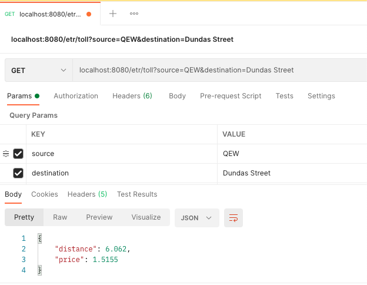

#Trip Calculator
##Solution Approach
###Brute force(I did not take this approach)
This problem is straight forward, all we need to do is read from the js file, 
and whenever we want to calculate the distance and rate we just loop from source 
to destination summing up the distances in between.

But, here is the catch, everytime we want to calculate the distance we will be 
looping through the interchanges which is O(N) costly operation. There is a more 
simplified and straightforward approach for solving this which can be done in 
constant time O(1).

###Approach I used

Subtraction using number line, all you have to do is plot your interchanges as 
points on a line with their distances from first interchange as their values. 
For finding the distance all you have to do is read the values of source 
and destination and subtract them. 

##What if this is a real application
###Problem1: 
what if this calculator needs to be consumed in billing application or 
at tool booths or other applications.
###Solution: 
make it a rest endpoint.

###Problem2: 
Do we have to read from the json File everytime.
###Solution: 
No, we can either read from json file once and load it in cache **or** 
configure a Scheduled method to load the tollLine(number line) once in 
given interval say once in 24 hours of time as we don't open up interchanges quiet often.
so now all the operation just cost O(1).

##What all did I do:
1. created a rest endpoint to fetch the distance and price form one point to another.
2. `ScheduledTripCalculatorService` that has:
    * `loadTollLineMap` scheduled method to load Js only once a day. 
    * `getTollDetails` to get the toll details like price and distance.
    
3. `InterchangesService`
    * reads from json file.
    
##Spinning up the service and running the tests:
###Running the server
1. Import the project into your favourite IDE
2. Run the `TripCalculatorApplication` class, this will spin up 
   the application and start your tomcat on 8080
3. Hit the end point using postman/browser.
   `localhost:8080/etr/toll?source=QEW&destination=Dundas Street`

###Running the tests
1. Just click on the `ScheduledTripCalculatorServiceTest` and run

##What could have been better

* Unit tests are written at the `ScheduledTripCalculatorService` to test the main functionality. 
  If this was a real project we would follow proper TDD and write FeatureFiles/functional test in advance 
  to cover each endpoint and functionality.
  
* Price and interchanges Data should have been abstracted away from the application, 
  and have a mechanism to reload these when changes are made. 
  Currently, the scheduled method reloads the number line every 24 hours in this application
  If we just abstract the json file out of this app we can achieve this.
  However, luckily there are many options to externalise your configuration, 
  Spring Boot even supports this logic out of the box.
    
